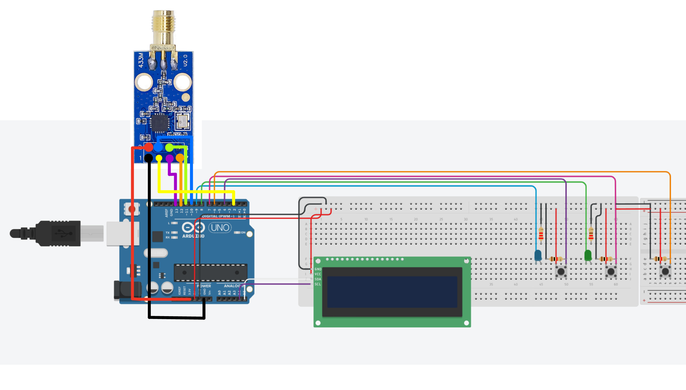

# Frequency Control and Attack with Arduino and CC1101

## Description
This project implements a system to control a **CC1101** module using an **Arduino**. The system allows two main functionalities: **frequency reading** and **interference transmission (attack)**, using buttons and an **LCD screen** for easy interaction.

>[!WARNING] 
>Code under supervision and possible modifications can be added

## Features
- **Interactive Menu**: Displays a menu on the LCD screen with two options:
  1. **Read Frequency**
  2. **Start Attack**
- **Frequency Reading**: Using the **CC1101** module, the system can receive signals on a specific frequency (433.900 MHz) and display them on both the LCD screen and the serial monitor.
- **Interference Transmission**: The system can generate continuous interference signals on the 433.898 MHz frequency.
- **Button Control**: The system allows selecting between reading or attack modes by pressing buttons, with the option to return to the main menu by pressing the same button again.

## Components Used
- **Arduino**
- **2x CC1101 (RF module)**
- **LCD I2C Display (16x2)**
- **3x Buttons for interaction**
- **2x LEDs to indicate the status of reading and attack modes**
- **Flipper zero to read and analyze frequencies**

## Usage
This project is designed to provide basic control over radio frequency signals using the **CC1101** module and can be expanded or adapted for various signal testing and analysis purposes.

## Getting Started
### Prerequisites
- **Arduino IDE**: Download and install the [Arduino IDE](https://www.arduino.cc/en/software).
- **ELECHOUSE CC1101 Library**: Install the **ELECHOUSE CC1101** library from the Arduino Library Manager.

### Setup and Wiring

# CC1101 Wiring with Arduino Uno

Connect the components as follows:

| **Component**  | **Arduino Pin** |
| -------------- | --------------- |
| **CC1101 VCC** | 3.3V            |
| **CC1101 GND** | GND             |
| **CC1101 MOSI**| Pin 11          |
| **CC1101 MISO**| Pin 12          |
| **CC1101 SCK** | Pin 13          |
| **CC1101 CS**  | Pin 10          |
| **LCD SDA**    | A4              |
| **LCD SCL**    | A5              |
| **Button 1**   | Pin 4           |
| **Button 2**   | Pin 7           |
| **Button 3**   | Pin 6           |
| **LED 1**      | Pin 9           |
| **LED 2**      | Pin 8           |

# CC1101 Wiring with Flipper Zero

This diagram shows the wiring of the **CC1101** module connected to the **Flipper Zero** using male-female jumper wires. Make sure to connect the pins as follows:

- **Flipper Zero MOSI → CC1101 MOSI**
- **Flipper Zero MISO → CC1101 MISO**
- **Flipper Zero CS → CC1101 CS**
- **Flipper Zero SCK → CC1101 SCK**
- **Flipper Zero GD0 → CC1101 GD0**
- **Flipper Zero VCC → CC1101 VCC**
- **Flipper Zero GND → CC1101 GND**

For more details, visit the repository by [**quen0n**](https://github.com/quen0n/flipperzero-ext-cc1101) for Flipper Zero CC1101 Extension.

### How to Use
1. **Upload the code** to your Arduino.
2. **Power the Arduino** and the interactive menu will appear on the LCD screen.
3. **Press Button 1** to enter frequency reading mode.
4. **Press Button 2** to start the interference attack.
5. **Press the button again** to return to the main menu.

